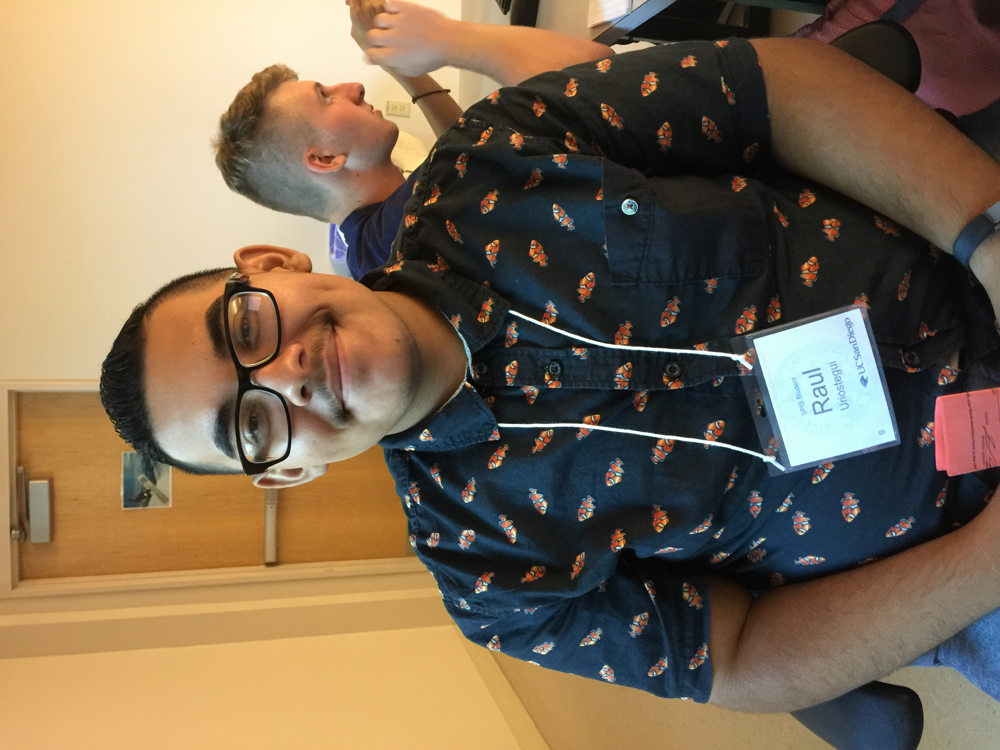

# practice-raul-u
Hi! My name is Raul Uriostegui and I am from South Gate, CA. The thing I hope to get from the SPIS programming is a sense of understanding the concepts of programming and a feel what is it is like to live on campus away from friends and family. Some interesting things about me is that I love to play PC games and enjoy watching political debates and podcasts. 

